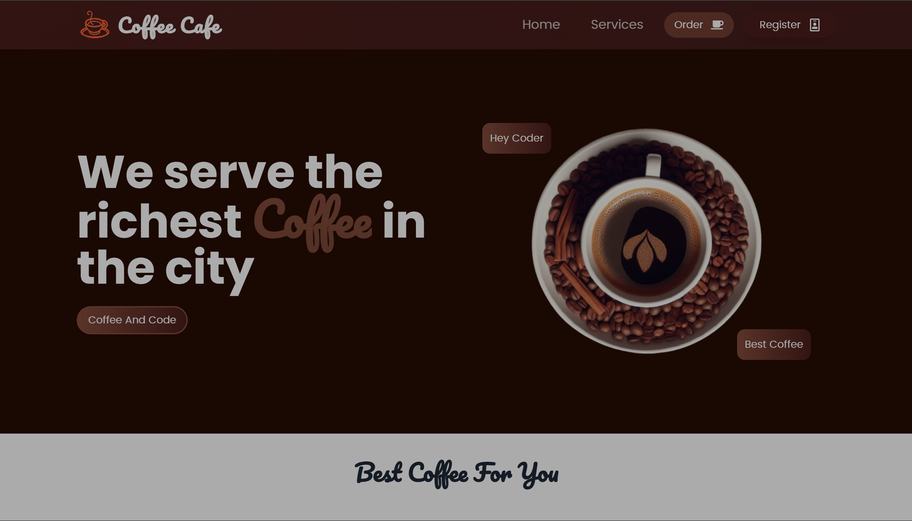
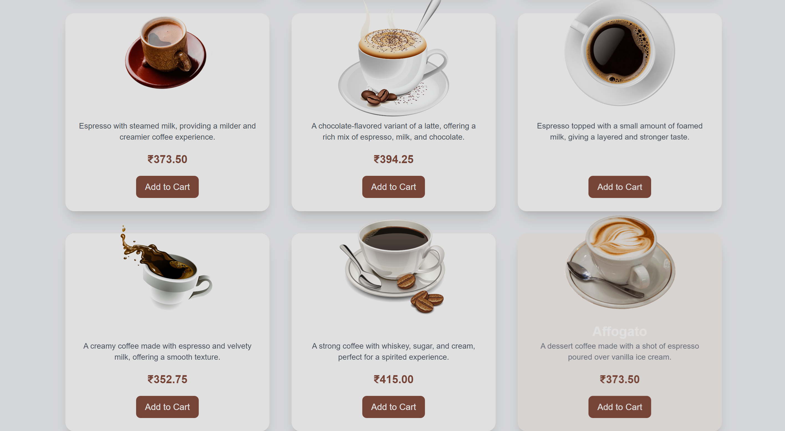

# Dens Gym-Application

## Demo

### Dashboard
<div align="center">
  <h3>This page refers to the payment methods, viewing more details about the product, and adding items to the cart. Already added items will be notified.</h3>
  
  
  <h3>This image shows the order details. The products added to the cart are displayed here, with options to delete products and view the total at the bottom.</h3>
  
  
  <h3>This page displays pricing details for fitness counseling, including monthly plans, yearly plans, free trials, discounts, promotions, and policies.</h3>
  
  
  <h3>The login page allows only authenticated users to log in, with password strength indicators (low, medium, high).</h3>
  
  
  <h3>This is the home page of the Gym Application, showcasing the main features and layout.</h3>
  
  
  <h3>Customer feedback and ratings about the products and training services are displayed here, including feedback for fitness and muscle building.</h3>
  
  
  <h3>These images show the available trainers for fitness, daily health, yoga, and bodybuilding. You can contact trainers for premium services.</h3>
  
  
  <h3>Additional details about trainers, including their availability and contact information.</h3>
  
  
  <h3>Products available for sale are displayed here.</h3>
  
</div>

## Links

- [Gym Application](https://gymapplication.vercel.app/)
- [Densingh's Portfolio](https://densingh.vercel.app/)
- [Restaurant Application](https://restaurent-alpha.vercel.app/)
- [Coffee Application](https://github.com/yourusername/coffee-application)
- 🔹 [Report Bug](https://github.com/ddensingh/issues)
- 🔹 [Request Feature](https://github.com/ddensingh/issues)

## Dens

You can fork this repository to modify and make changes of your own. Please give proper credit by linking back to [Densingh](https://github.com/ddensingh). Thanks!

## Built With

My personal portfolio, [Densingh](https://densingh.vercel.app/), features some of my GitHub projects as well as my resume and technical skills.

This project was built using these technologies:

- **React.js**
- **Node.js**
- **Express.js**
- **CSS3**
- **VS Code**
- **Vercel**

## Features

- 📖 **Multi-Page Layout**
- 🎨 **Styled with React-Bootstrap and CSS with easy-to-customize colors**
- 📱 **Fully Responsive**

## Getting Started

To get started with this project, follow these steps:

1. **Clone this repository:**
    ```bash
    git clone https://github.com/ddensingh/dens-gym-application.git
    ```

2. **Navigate to the project directory:**
    ```bash
    cd dens-gym-application
    ```

3. **Install dependencies:**
    ```bash
    npm install
    ```

4. **Run the application:**
    ```bash
    npm start
    ```

   This command starts the app in development mode. Open [http://localhost:3000](http://localhost:3000) to view it in the browser. The page will reload if you make edits.

---

# Coffee Application

Welcome to the Coffee Application! This application allows users to browse and purchase coffee products with a seamless and visually appealing user interface. Below is an overview of the key features and pages of the application.

## Home Page

The home page provides a modern and inviting layout showcasing a variety of coffee products. Users can easily navigate through the available options and view detailed product information.



### Features
- **Product Browsing:** Users can scroll through a list of coffee products.
- **Product Details:** Each product has a detailed view with high-quality images and descriptions.
- **Search and Filters:** Users can search for specific coffee types or filter by preferences.

## Cart Page

The cart page displays the products added by the user. It allows users to review their selections and proceed to checkout.



### Features
- **View Cart Items:** Users can see all products added to their cart with options to modify quantities or remove items.
- **Toast Notifications:** Adding or removing products triggers toast notifications for user feedback.
- **Checkout Button:** Users can proceed to the checkout process directly from the cart page.

## Functionalities

### Cart Functionality
- **Product Addition:** Users can add products to the cart with a single click.
- **Cart Management:** Modify quantities or remove products with ease.
- **Toast Notifications:** Notifications confirm actions like adding or removing products.

### Firebase Integration
- **User Authentication:** Secure sign-up and login using Firebase Authentication with email/password or Google.
- **Cart Data Storage:** Cart data is saved in Firebase Firestore for cross-device access.
- **Real-Time Updates:** Real-time synchronization of cart data.

### UI Design
- **Modern Aesthetics:** Clean, modern look with high-quality images and stylish fonts.
- **Responsive Design:** Optimized for all device sizes.
- **Color Scheme:** Warm colors to match the coffee theme.

### Framer Motion Animations
- **Product Animations:** Smooth interactions for adding items and viewing details.
- **Cart Transitions:** Fluid animations for cart updates.
- **Loading Animations:** Engaging animations while data is being processed.

## User Registration Page

The user registration page allows new users to create an account and log in securely.


### Features
- **Sign-Up Form:** Simple form for creating a new account.
- **Google Sign-In:** Option to sign in using Google for convenience.
- **Validation:** Ensures all required fields are completed and provides feedback on errors.

## Installation and Setup

1. **Clone the repository:**
    ```bash
    git clone https://github.com/yourusername/coffee-application.git
    ```

2. **Navigate to the project directory:**
    ```bash
    cd coffee-application
    ```

3. **Install dependencies:**
    ```bash
    npm install
    ```

4. **Configure Firebase:** Set up Firebase and add your configuration to the project.

5. **Run the application:**
    ```bash
    npm start
    ```

---

## Contributing

Feel free to contribute to the project by submitting pull requests or opening issues. Your feedback and contributions are appreciated!

## License

This project is licensed under the MIT License - see the [LICENSE](LICENSE) file for details.

---

Enjoy using the Coffee Application! If you have any questions or need further assistance, please contact us.
