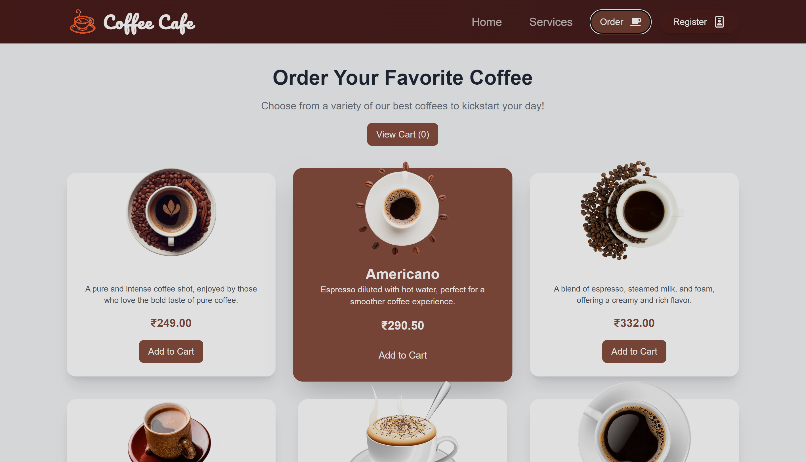
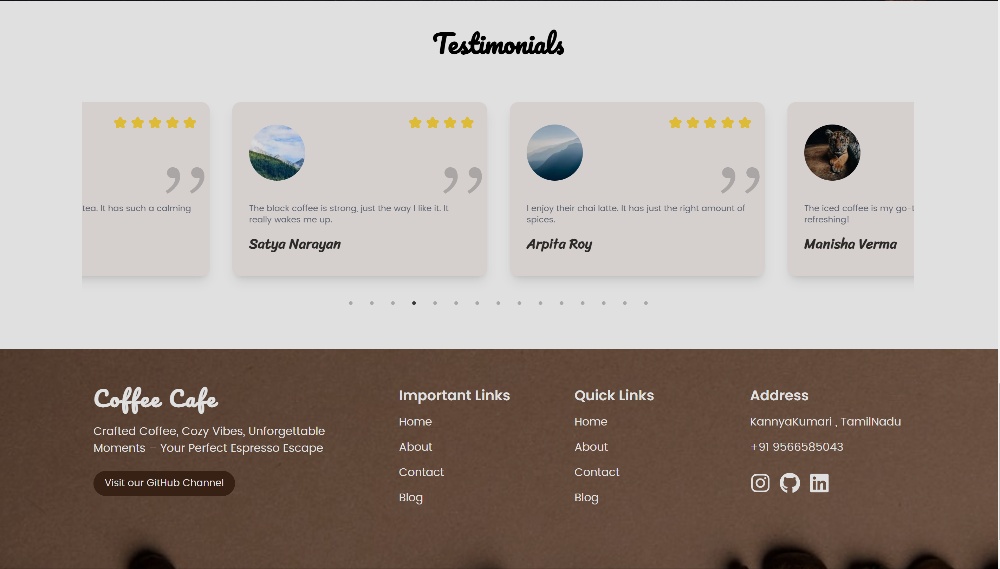
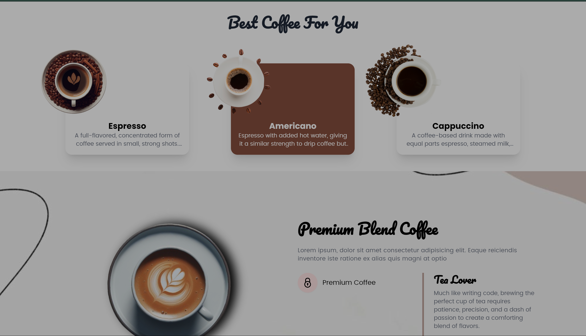

# Coffee Application

Welcome to the Coffee Application! This application allows users to browse and purchase coffee products with a seamless and visually appealing user interface. Below is an overview of the key features and pages of the application.

## Home Page

The home page provides a modern and inviting layout showcasing a variety of coffee products. Users can easily navigate through the available options and view detailed product information.

### Features
- **Product Browsing:** Users can scroll through a list of coffee products.
- **Product Details:** Each product has a detailed view with high-quality images and descriptions.
- **Search and Filters:** Users can search for specific coffee types or filter by preferences.

## Cart Page

The cart page displays the products added by the user. It allows users to review their selections and proceed to checkout.

### Features
- **View Cart Items:** Users can see all products added to their cart with options to modify quantities or remove items.
- **Toast Notifications:** Adding or removing products triggers toast notifications for user feedback.
- **Checkout Button:** Users can proceed to the checkout process directly from the cart page.

## Functionalities

### Cart Functionality
- **Product Addition:** Users can add products to the cart with a single click.
- **Cart Management:** Modify quantities or remove products with ease.
- **Toast Notifications:** Notifications confirm actions like adding or removing products.

### Firebase Integration
- **User Authentication:** Secure sign-up and login using Firebase Authentication with email/password or Google.
- **Cart Data Storage:** Cart data is saved in Firebase Firestore for cross-device access.
- **Real-Time Updates:** Real-time synchronization of cart data.

### UI Design
- **Modern Aesthetics:** Clean, modern look with high-quality images and stylish fonts.
- **Responsive Design:** Optimized for all device sizes.
- **Color Scheme:** Warm colors to match the coffee theme.

### Framer Motion Animations
- **Product Animations:** Smooth interactions for adding items and viewing details.
- **Cart Transitions:** Fluid animations for cart updates.
- **Loading Animations:** Engaging animations while data is being processed.

## User Registration Page

The user registration page allows new users to create an account and log in securely.

### Features
- **Sign-Up Form:** Simple form for creating a new account.
- **Google Sign-In:** Option to sign in using Google for convenience.
- **Validation:** Ensures all required fields are completed and provides feedback on errors.

## Additional Screenshots

Here are some additional screenshots that showcase various aspects of the application:

## Installation and Setup

1. Clone the repository: git clone https://github.com/yourusername/coffee-application.git
2. Navigate to the project directory: cd coffee-application
3. Install dependencies: npm install
4. Configure Firebase: Set up Firebase and add your configuration to the project.
5. Run the application: npm start

## Contributing

Feel free to contribute to the project by submitting pull requests or opening issues. Your feedback and contributions are appreciated!

## License

This project is licensed under the MIT License - see the [LICENSE](LICENSE) file for details.

---
other project:
### Demo Link:

- [Gym Application](https://gymapplication.vercel.app/)
- [Portfolio](https://densingh.vercel.app/)
- [Restaurant Application](https://restaurent-alpha.vercel.app/)
Enjoy using the Coffee Application! If you have any questions or need further assistance, please contact us.
